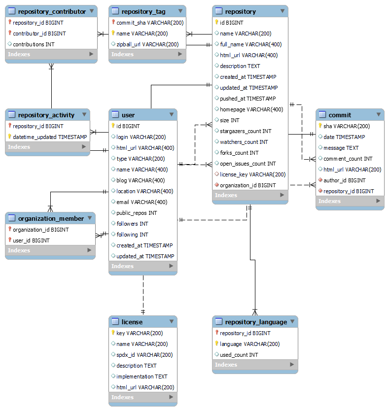

# Github Top 35 Open Source Companies Data Pipeline

In this project, I will create data pipeline for collecting top 35 open source company profile and their repositories, commits, members, ... I update them and do analysis hourly.

## Data source
[Github APIs](https://docs.github.com/en/rest) (or Github ReST APIs) are the APIs that you can use to interact with GitHub. They allow you to create and manage repositories, branches, issues, pull requests, and many more. For fetching publicly available information (like public repositories, user profiles, etc.), you can call the API. For other actions, you need to provide an authenticated token.
```
- Company : https://api.github.com/orgs/<Company Name>

- User : https://api.github.com/users/<User Name>

- Company Member : https://api.github.com/orgs/<Company Name>/members

- Repository : https://api.github.com/repos/<Company Name>/<Repository Name>

- Repository Commit : https://api.github.com/repos/<Company name>/<Repository Name>/commits

- Repository Language : https://api.github.com/repos/<Company Name>/<Repository Name>/languages

- Repository Tag : https://api.github.com/repos/<Company Name>/<Repository Name>/tags

- License : https://api.github.com/licenses/<License Key>

- Repository Activity : https://github.com/orgs/<Company Name>/repositories
```

With Repository Activity, I used [BeautifulSoup](https://www.crummy.com/software/BeautifulSoup/bs4/doc/), a Python package for parsing HTML and XML documents (including having malformed markup, i.e. non-closed tags, so named after tag soup). It can creates a parse tree for parsed pages that can be used to extract data from HTML, which is useful for web scraping. 

## Architecture


### Tools & Technologies

- Cloud - [**Supabase Cloud**](https://supabase.com/)
- Containerization - [**Docker**](https://www.docker.com), [**Docker Compose**](https://docs.docker.com/compose/)
- Batch Processing - [**Spark**](https://spark.apache.org/)
- Orchestration - [**Airflow**](https://airflow.apache.org)
- Transformation - [**dbt**](https://www.getdbt.com)
- Data Lake - [**Supabase Storage**](https://supabase.com/docs/guides/storage)
- Data Warehouse - [**Postgres**](https://www.postgresql.org/)
- Data Visualization - [**Power BI**](https://powerbi.microsoft.com/en-au/)
- Language - [**Python**](https://www.python.org)


## Database Design



- LICENSE : Open source software need to be licensed (to provide rights to modify, distribute other than creator) so the repository in which the software dwells should include the license file.
- USER : Include Company/Organization and normal User
- REPOSITORY : A central location where the user's data is stored.
- COMMIT : A command that is used to save your changes to the local repository.
- REPOSITORY TAG : A commit that is marked at a point in your repository history
- REPOSITORY CONTRIBUTOR : A User who has at least 1 commit for a specific repository
- REPOSITORY LANGUAGE : Programming languages that a repository used
## Final Result

# Setup
## Prerequisite
- Install [Docker](https://docs.docker.com/desktop/windows/install/) and [Docker Compose](https://docs.docker.com/compose/install/)

- [Create your own Account and Storage on Supabase](https://supabase.com/docs/guides/storage)

- [Create your personal access token on Github](https://docs.github.com/en/authentication/keeping-your-account-and-data-secure/creating-a-personal-access-token). If you don't do this, you can only extract 60 times/hour instead of 5000 times/hour using the GitHub rest api. 

- Remember to use use your own key and version in Docker and Docker Compose file.

## Running
1. Docker - Airflow - Spark

    **a) Service**

    When you check the Docker and Docker Compose file in airflow directory, you can see main services that I used:

    - Postgres - Airflow

        - Version 13
        - Port 5432

    - Airflow Webserver

        - Version Apache Airflow 2.3.1
        - Port 8080

    - Spark Master

        - Version Bitnami Spark 3.2.1
        - Port 8181

    - PG Admin

        - Version 4
        - Port 5050
        

    **b) Running**
    ```bash
    cd airflow
    Docker-compose build
    ```
    You will need to wait 10-15 minutes for the first time.

    To run the VM: 
    
    ```bash
    Docker-compose up
    ```
    You also will be asked to wait 10-15 minutes for the first time.
    After running successfully, you can open another terminal and run:
    ```bash
    Docker ps
    ```
    The successful running setup:
    

    Now you can check whether it runs or not by using below service urls.

    - Airflow : http://localhost:8080/
    
    - PG Admin : http://localhost:5050/
    
    - Spark : http://localhost:8181/
    

    Next you need to add connection on Airflow for 

    - [Postgres Connection](https://hevodata.com/learn/airflow-postgres-operator/) 
    
    and 
    - [Spark Connection](https://github.com/cordon-thiago/airflow-spark)
    

    If you can go there, you have successfully setup Airflow. Now you can run all the tasks except *dbt_analysis_daily* (I will instruct you to run this in the next section).

    **c) Result**
    
    - DAG *create_postgres_database* (Create tables)
    

    - DAG *spark-postgres* (Load historical data)
    

    - DAG *update_github_repo_hourly* (Load data hourly)
    
2. DBT

    As you can see in the previous section, If you run DAG *dbt_analysis_daily*, system will throw error. Now let's setup nescessary things to run it sucessfullly.

    Open new terminal and run:
    ```bash
    docker ps
    ```
    Let's find the first Airflow container's id and copy it:
    
    Then run:
    ```bash
    docker exec -it bdd46fa14ba4 bash
    cd /opt/dbt
    dbt build
    ```
    After running these commands, you will see:
    

    Now you can go back to Airflow and run DAB *dbt_analysis_daily*


